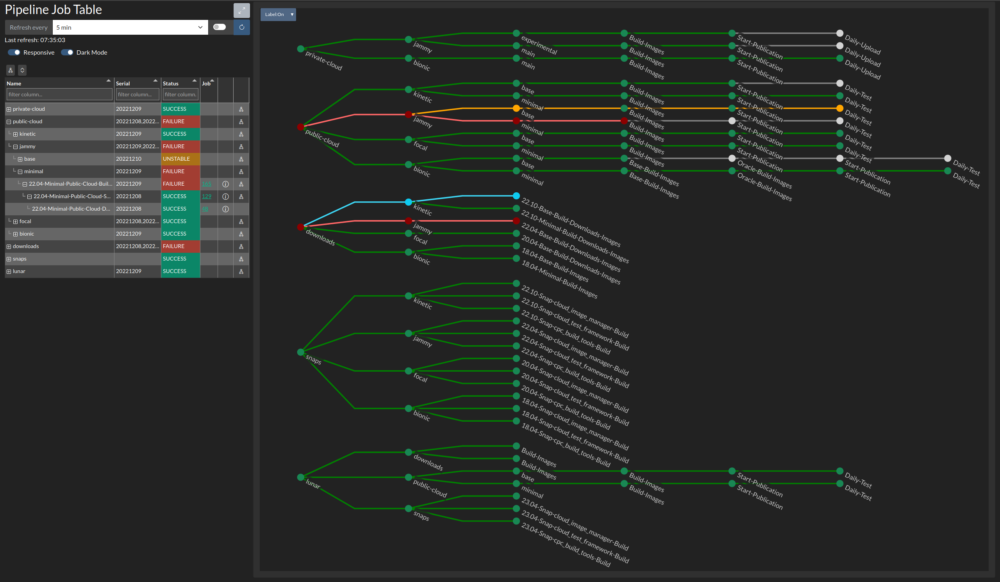
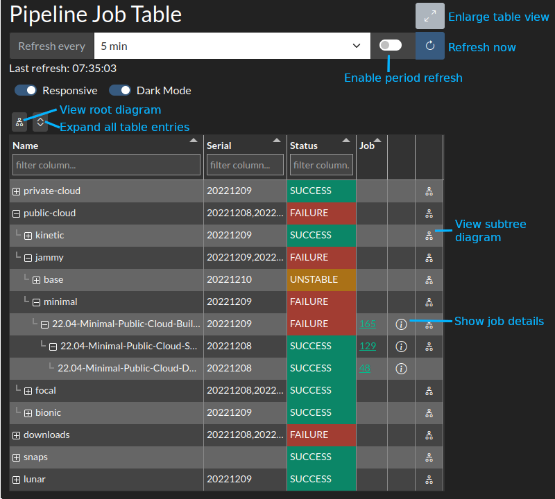
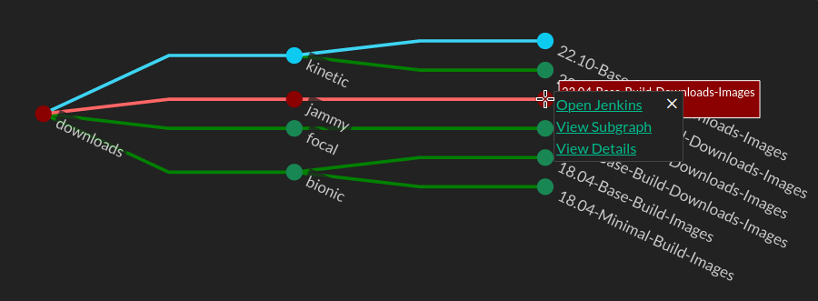

# pipeline-dash

Tool to help inspect, observe, and visualize build pipelines.



<!-- TOC -->
* [pipeline-dash](#pipeline-dash)
  * [Features](#features)
  * [Usage](#usage)
    * [CLI Usage](#cli-usage)
    * [Jobs YAML Files](#jobs-yaml-files)
  * [UI](#ui)
    * [Dash](#dash)
      * [Left Job Table Pane](#left-job-table-pane)
      * [Right Pipeline Diagram Pane](#right-pipeline-diagram-pane)
<!-- TOC -->

## Features
* Pipeline engines supported:
  * Jenkins
* Collect job data from multiple controllers into a unified dashboard/pipeline
* Customize how pipeline structure is organized
* Pipeline status is collected from all downstream jobs
* Collects serial associated with job/pipeline
  * TODO: In the future, this will be configurable, since most pipelines outside my initial use-case won't have a serial
  * NOTE: When no serial is found, the information is just left blank in the dashboard
* Table of all jobs in pipelines with filtering and sorting
* Subway map visualization of pipelines
  * Job status as color
  * Automatic job name shorting on map to reduce clutter
* Show extended job information
* Quickly navigate to job URL
* Narrow subway map visualization to subtree
* Periodic refresh
* Export subway map as image
* Dark and light mode

## Usage

The easiest way to run `pipeline-dash` is to use `poetry` to install and run the tool.

``` bash
git clone <REPO_URL>
cd pipeline-dash
poetry install
poetry run cli dash [OPTIONS] <JOB_FILE>
```

**Note**: `poetry install` only installs into a virtualenv, this will not affect your system.


### CLI Usage
```text
 Usage: cli dash [OPTIONS] JOBS_FILE                                                                                    
                                                                                                                        
╭─ Options ────────────────────────────────────────────────────────────────────────────────────────────────────────────╮
│ --recurse                 BETA: Recursively fetch job data for EVERY job listed                                      │
│ --verbose                 Show verbose output                                                                        │
│ --debug                   Turn on debug features (verbose logging, inspection features, etc)                         │
│ --cache             TEXT  Directory to cache data [default: /home/shammer/git/pipeline-dash/pipeline_dash/.cache]    │
│ --store             TEXT  EXPERIMENTAL: Directory to store Jenkins JSON data                                         │
│ --load              TEXT  EXPERIMENTAL: Directory to load Jenkins JSON data                                          │
│ --auth/--no-auth          EXPERIMENTAL: Perform login.ubuntu.com SSO authentication [default: no-auth]               │
│ --user-file         TEXT  User file if server authentication is required                                             │
│ --help                    Show this message and exit.                                                                │
╰──────────────────────────────────────────────────────────────────────────────────────────────────────────────────────╯
```

### Jobs YAML Files
The `cli dash` command requires a `JOBS_FILE`, which is a YAML file that specifies the pipeline of jobs that you want
to collect data for and visualize. 

The file consists of a mapping of servers and the pipelines on each of those servers.  Pipeline collections are defined 
by and entry starting with a `.` (e.g. `.cool-project`). Collections with the same name (and hierachy) across multiple
servers are collected and displayed together.

If we take a simple example of the `cool-project` project, which has a pipeline split across two controllers:
```yaml
servers:
  "https:build-server-url.com/endpoint/":
    pipelines:
      .cool-project:
        "Cool-Project-Build":
            "Cool-Project-Package":
                "Cool-Project-Stage":
  "https:test-server-url.com/endpoint/":
    pipelines:
      .cool-project:
        "Cool-Project-Test":
          "Cool-Project-Promote":
```

This would generate a table view along the lines of this:

| Name                  | Serial   | Status   | Job    |
|-----------------------|----------|----------|--------|
| cool-project          | 101, 102 | UNSTABLE |        |
| ⊢ Cool-Project-Build  | 102      | SUCCESS  | [12]() |
|  ⊢ Cool-Project-Package | 102      | SUCCESS  | [10]() |
|   ⊢ Cool-Project-Stage | 102      | UNSTABLE | [5]()  |
| ⊢ Cool-Project-Test   | 101      | SUCCESS  | [3]()  |
|  ⊢ Cool-Project-Promote | 101      | Not Run  |        |

And would generate a pipeline visualization along the lines of:

```text
cool-project ─┬─── Cool-Project-Build ──── Package ────── Stage
              │
              │
              └─── Cool-Project-Test ───── Promote
```

See [jobs file doc](config/jobs_file.md) for more details.


## UI
### Dash
Dash is the visualization mode using the [dash](https://github.com/plotly/dash) library.

This view generates a table and a pipeline subway map diagram.

#### Left Job Table Pane
On the left you can 
* manually refresh job data
* configure period job data refresh
* view, sort, filter the job data



#### Right Pipeline Diagram Pane
On the right you can view the subway map of the pipelines (or selected subtree)

Hover over a node to view brief information


Click on a node to bring up further options:
* Open selected job's URL in a new tab
* Change right side diagram view to show a subgraph with the selected node as root
* View further job details in a bottom pane

